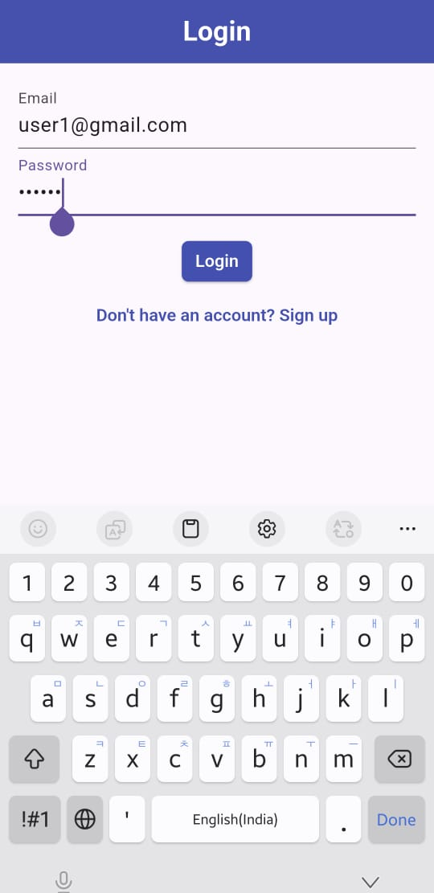
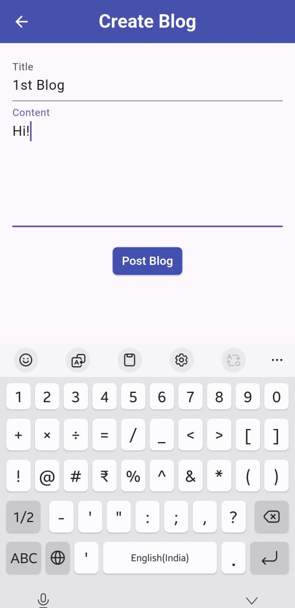
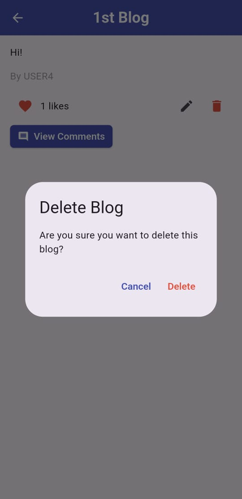
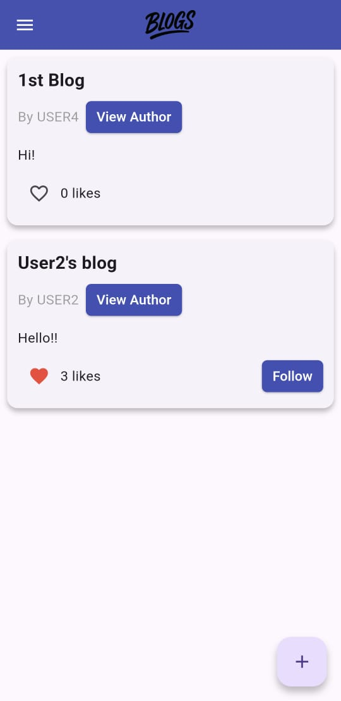
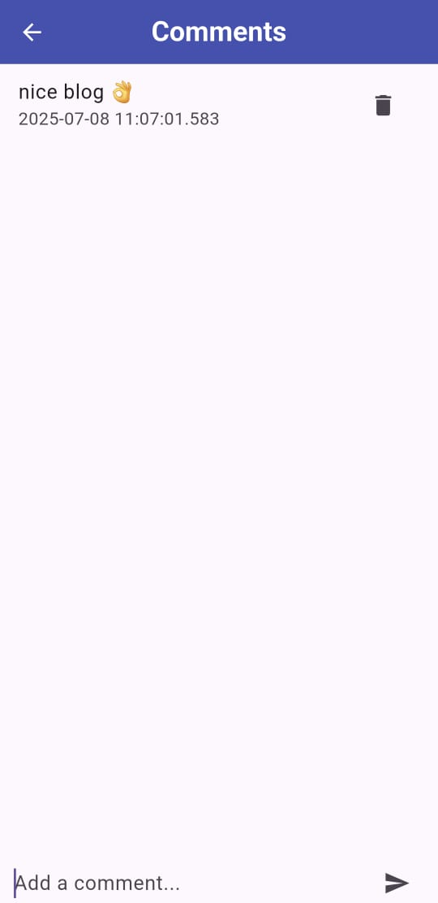
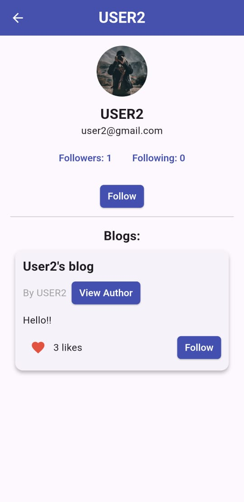

# My Blog App 📝✨

**My Blog App** is a full-featured social blogging platform built using **Flutter** and **Firebase**. It allows users to create, explore, and engage with blog posts in real time. Users can like, comment, follow others, and manage their own content with ease.

---

## 🚀 Features

- ✍️ Create, edit, and delete blogs
- ❤️ Like and comment on posts
- 👤 View user profiles
- 🧑‍🤝‍🧑 Follow and unfollow other users
- 🌐 Explore all blogs or filter by followed users
- 📸 Profile pictures with caching support
- 🔐 Firebase Authentication
- 🔄 Real-time updates using Firestore and Provider

---

## 📷 Screenshots

  
  
  
  
  
  
  
  
  
  
  

---

## 🎥 Demo Video

**[Click here to watch the demo video](https://drive.google.com/file/d/17YKkntm_VwRFaQIG2QbMQlLSxTvGnYzg/view?usp=drive_link)**

---

## 🧱 Firestore Database Schema

### `users (Collection)`
| Field         | Type    | Description                            |
|---------------|---------|----------------------------------------|
| uid           | String  | Firebase UID                           |
| username      | String  | Display name                           |
| email         | String  | User email                             |
| profilePicUrl | String  | Profile photo URL                      |
| followers     | List    | UIDs of users who follow this user     |
| following     | List    | UIDs of users this user is following   |

### `blogs (Collection)`
| Field       | Type    | Description                        |
|-------------|---------|------------------------------------|
| blogId      | String  | Auto-generated ID                  |
| authorId    | String  | UID of the author                  |
| authorName  | String  | Name of the author                 |
| title       | String  | Blog title                         |
| content     | String  | Blog body                          |
| timestamp   | DateTime| Time of creation                   |
| likes       | List    | UIDs who liked the post            |

### `comments (Subcollection under blogs/{blogId}/comments)`
| Field        | Type    | Description                        |
|--------------|---------|------------------------------------|
| commentId    | String  | Auto-generated ID                  |
| commenterId  | String  | UID of the commenter               |
| content      | String  | Comment text                       |
| timestamp    | DateTime| Time of comment                    |

---

## 📱 Tech Stack

- **Flutter** & **Dart**
- **Firebase Auth** for user login/signup
- **Cloud Firestore** for blogs, users, and comments
- **Provider** for state management
- **CachedNetworkImage** for profile pictures

---

## 📦 Packages Used

- `firebase_core`
- `firebase_auth`
- `cloud_firestore`
- `provider`
- `cached_network_image`

---

## 🧑‍🎓 Student Details

- **Name:** A. V. S. Manoj  
- **Roll No:** 23110025  
- **College:** IIT Gandhinagar  
- **Discipline:** Computer Science and Engineering (CSE)

---

## 📝 Notes

> This project was developed as part of the **Week 4 assignment** for the Flutter + Firebase App Development course.  
> It demonstrates key concepts in authentication, Firestore schema design, and responsive Flutter app architecture.

---
